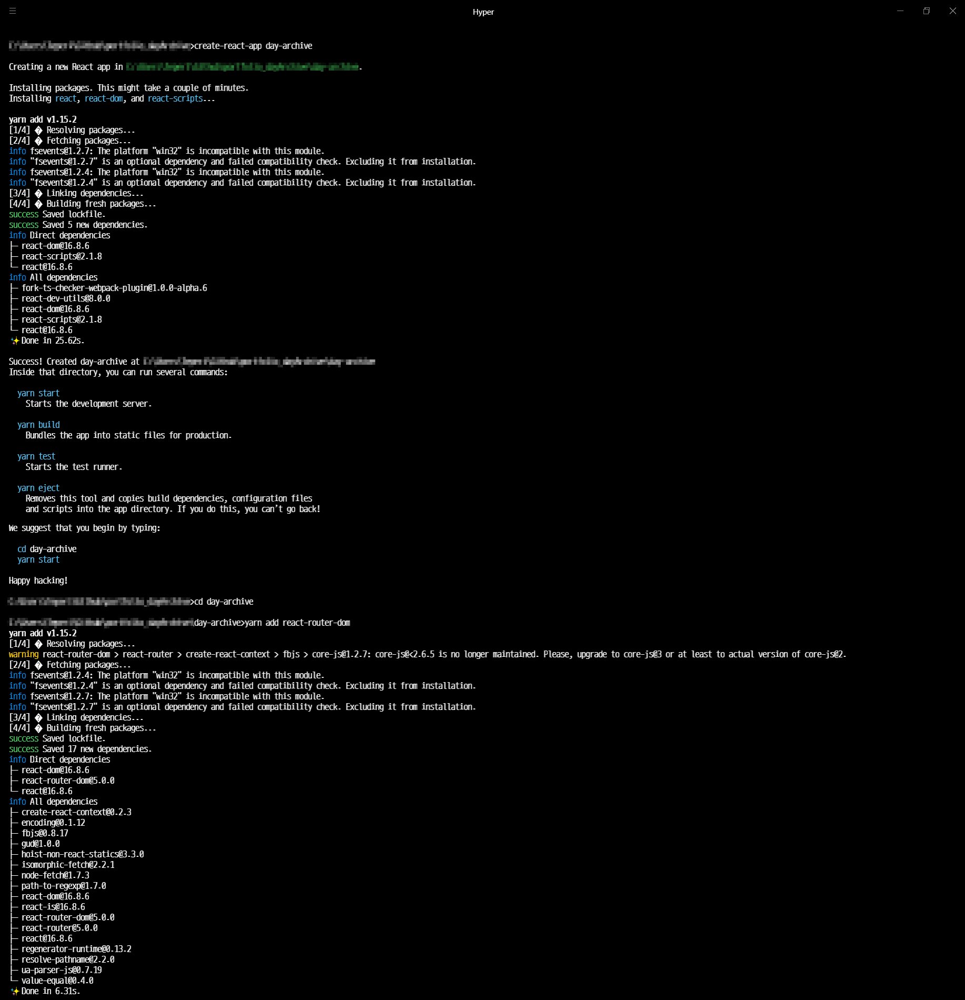

# script 작업 내역

- 작업 내역 중 Script 부분 모음

## 2019.04.17

- Material-UI SVG icon 설치

```bash
Teperi@DESKTOP-EAT2G59 MINGW64 ~/Github/portfolio_dayArchive/day-archive (mainPage)
$ yarn add @material-ui/icons
yarn add v1.15.2

[4/4] Building fresh packages...

success Saved lockfile.
success Saved 1 new dependency.
info Direct dependencies
└─ @material-ui/icons@3.0.2
info All dependencies
└─ @material-ui/icons@3.0.2
Done in 23.18s.
```

## 2019.04.16

- Material-UI 설치

```bash
Teperi@DESKTOP-EAT2G59 MINGW64 ~/Github/portfolio_dayArchive/day-archive (master)
$ yarn add @material-ui/core
yarn add v1.15.2

info fsevents@1.2.4: The platform "win32" is incompatible with this module.
info "fsevents@1.2.4" is an optional dependency and failed compatibility check. Excluding it from installation.
info fsevents@1.2.7: The platform "win32" is incompatible with this module.
info "fsevents@1.2.7" is an optional dependency and failed compatibility check. Excluding it from installation.
[3/4] Linking dependencies...
[4/4] Building fresh packages...
success Saved lockfile.
success Saved 31 new dependencies.
info Direct dependencies
└─ @material-ui/core@3.9.3
info All dependencies
├─ @material-ui/core@3.9.3
├─ @material-ui/system@3.0.0-alpha.2
├─ @material-ui/utils@3.0.0-alpha.3
├─ @types/jss@9.5.8
├─ @types/prop-types@15.7.0
├─ @types/react-transition-group@2.9.0
├─ @types/react@16.8.13
├─ brcast@3.0.1
├─ change-emitter@0.1.6
├─ classnames@2.2.6
├─ css-vendor@0.3.8
├─ csstype@2.6.3
├─ debounce@1.2.0
├─ dom-helpers@3.4.0
├─ hyphenate-style-name@1.0.3
├─ indefinite-observable@1.0.2
├─ is-in-browser@1.1.3
├─ jss-camel-case@6.1.0
├─ jss-default-unit@8.0.2
├─ jss-global@3.0.0
├─ jss-nested@6.0.1
├─ jss-props-sort@6.0.0
├─ jss-vendor-prefixer@7.0.0
├─ jss@9.8.7
├─ normalize-scroll-left@0.1.2
├─ popper.js@1.15.0
├─ react-event-listener@0.6.6
├─ react-lifecycles-compat@3.0.4
├─ react-transition-group@2.9.0
├─ recompose@0.30.0
└─ symbol-observable@1.2.0
Done in 9.61s.
```

## 2019.04.15

- Local(개발용 컴퓨터) 에 환경 설정
- day-archive
  - dayArchive 일때 대문자 A때문에 사용이 불가능함



```bash
C:\Users\Teperi\Github\portfolio_dayArchive>create-react-app day-archive

Creating a new React app in C:\Users\Teperi\Github\portfolio_dayArchive\day-archive.

Installing packages. This might take a couple of minutes.
Installing react, react-dom, and react-scripts...

yarn add v1.15.2
[1/4] �  Resolving packages...
[2/4] �  Fetching packages...
info fsevents@1.2.7: The platform "win32" is incompatible with this module.
info "fsevents@1.2.7" is an optional dependency and failed compatibility check. Excluding it from installation.
info fsevents@1.2.4: The platform "win32" is incompatible with this module.
info "fsevents@1.2.4" is an optional dependency and failed compatibility check. Excluding it from installation.
[3/4] �  Linking dependencies...
[4/4] �  Building fresh packages...
success Saved lockfile.
success Saved 5 new dependencies.
info Direct dependencies
├─ react-dom@16.8.6
├─ react-scripts@2.1.8
└─ react@16.8.6
info All dependencies
├─ fork-ts-checker-webpack-plugin@1.0.0-alpha.6
├─ react-dev-utils@8.0.0
├─ react-dom@16.8.6
├─ react-scripts@2.1.8
└─ react@16.8.6
✨  Done in 25.62s.

Success! Created day-archive at C:\Users\Teperi\Github\portfolio_dayArchive\day-archive
Inside that directory, you can run several commands:

  yarn start
    Starts the development server.

  yarn build
    Bundles the app into static files for production.

  yarn test
    Starts the test runner.

  yarn eject
    Removes this tool and copies build dependencies, configuration files
    and scripts into the app directory. If you do this, you can’t go back!

We suggest that you begin by typing:

  cd day-archive
  yarn start

Happy hacking!

C:\Users\Teperi\Github\portfolio_dayArchive>cd day-archive

C:\Users\Teperi\Github\portfolio_dayArchive\day-archive>yarn add react-router-dom
yarn add v1.15.2
[1/4] �  Resolving packages...
warning react-router-dom > react-router > create-react-context > fbjs > core-js@1.2.7: core-js@<2.6.5 is no longer maintained. Please, upgrade to core-js@3 or at least to actual version of core-js@2.
[2/4] �  Fetching packages...
info fsevents@1.2.4: The platform "win32" is incompatible with this module.
info "fsevents@1.2.4" is an optional dependency and failed compatibility check. Excluding it from installation.
info fsevents@1.2.7: The platform "win32" is incompatible with this module.
info "fsevents@1.2.7" is an optional dependency and failed compatibility check. Excluding it from installation.
[3/4] �  Linking dependencies...
[4/4] �  Building fresh packages...
success Saved lockfile.
success Saved 17 new dependencies.
info Direct dependencies
├─ react-dom@16.8.6
├─ react-router-dom@5.0.0
└─ react@16.8.6
info All dependencies
├─ create-react-context@0.2.3
├─ encoding@0.1.12
├─ fbjs@0.8.17
├─ gud@1.0.0
├─ hoist-non-react-statics@3.3.0
├─ isomorphic-fetch@2.2.1
├─ node-fetch@1.7.3
├─ path-to-regexp@1.7.0
├─ react-dom@16.8.6
├─ react-is@16.8.6
├─ react-router-dom@5.0.0
├─ react-router@5.0.0
├─ react@16.8.6
├─ regenerator-runtime@0.13.2
├─ resolve-pathname@2.2.0
├─ ua-parser-js@0.7.19
└─ value-equal@0.4.0
✨  Done in 6.31s.

C:\Users\Teperi\Github\portfolio_dayArchive\day-archive>
```
